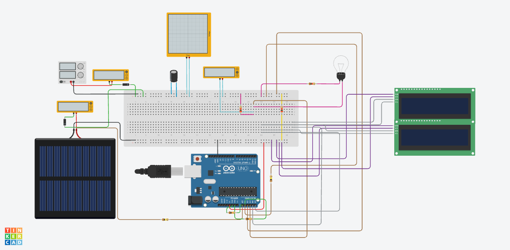

# Solar + Base Power Monitor (Tinkercad)

A two-source DC power system simulated in **Tinkercad Circuits**. A solar panel and a steady "base" power supply share one bus through diodes, a large capacitor rides through sudden changes in sunlight, and an Arduino measures everything and reports it on a **16x4 LCD screen** (two 16x2 I2C LCDs stacked).

The idea comes from how real grids work: a steady source (like a nuclear or thermal plant) holds the supply, and solar adds power whenever it can.

🔗 **Tinkercad simulation:** [open the circuit](https://www.tinkercad.com/things/k6qZcOtDjgk-solar-power) (Tinkercad login may be required)

---

## How it works

Both sources feed a shared **BUS** through their own diodes (a "diode-OR" arrangement), so whichever source has the higher voltage supplies the load. No switching logic is needed; the diodes do it by themselves.

| Sunlight | What happens | Bus voltage |
|---|---|---|
| None or weak | The 30 V supply carries the load | ~29.3 V (30 V minus the diode drop) |
| Medium | The panel gives all the current it can, and the supply fills in the rest | ~29.3 V |
| Strong | The panel carries the whole load and pushes the bus up, so the supply's diode blocks and it delivers 0 A | ~39 V |

A **0.47 F capacitor** across the bus smooths transitions. When the sunlight drops suddenly, the bus slides down over several seconds instead of falling instantly. This is the same "ride-through" job that supercapacitors do in real solar installations when a cloud passes.

The **Arduino** measures solar voltage and current, bus voltage, and load current, then calculates the base supply's current, the load power, and the percentage of the load being carried by solar.

### Measurement method

| Quantity | Method |
|---|---|
| Solar and bus voltage | Voltage divider (100 kΩ / 10 kΩ), dividing by 11 so 40 V reads as ~3.6 V |
| Solar current | 0.2 Ω shunt resistor between the RETURN rail and Arduino ground |
| Load current | 0.2 Ω shunt resistor in the load's return path |
| Base supply current | Calculated: load current minus solar current |

---

## Design files

| File | What it is |
|---|---|
| [Schematic (PDF)](SolarMonitor.pdf) | Circuit schematic exported from Tinkercad |
| [PCB board file (.brd)](SolarMonitor.brd) | Board file exported from Tinkercad, opens in Autodesk Fusion or KiCad (import) |
| [`solar_monitor.ino`](solar_monitor.ino) | Arduino code |

---

## Parts

| Part (Tinkercad name) | Qty | Settings |
|---|---|---|
| Arduino Uno R3 | 1 | |
| Breadboard (full size) | 1 | |
| Power Supply | 1 | 30 V, 5 A limit |
| Solar Cell | 1 | peak 40 V, peak 5 A |
| Diode | 2 | |
| Polarized Capacitor | 1 | 0.47 F (see notes) |
| Light Bulb | 1 | the load |
| Resistor | 2 | 0.2 Ω (current shunts) |
| Resistor | 2 | 100 kΩ (voltage dividers) |
| Resistor | 2 | 10 kΩ (voltage dividers) |
| Multimeter | 3 | source currents and bulb voltage |
| Oscilloscope | 1 | watching the bus voltage |
| LCD 16x2 (I2C) | 2 | addresses 0x20 and 0x21 |

**For a real build:** the diodes would be Schottky diodes rated 10 A or more, the shunts would be 5 W power resistors, and 0.47 F at 40 V would be a bank of series-connected supercapacitors rated above 50 V.

---

## Rails

The circuit has **two separate grounds**, connected only through the solar shunt resistor. That is what lets the Arduino measure solar current.

| Rail | Name | Purpose |
|---|---|---|
| Top + | BUS | shared power line, after both diodes |
| Top – | RETURN | return path for the bulb, capacitor and base supply |
| Bottom – | GND | Arduino ground and solar panel – |
| Bottom + | 5V | Arduino 5V, for the LCDs only |

⚠️ The top – and bottom – rails must **not** be joined by a wire. The 0.2 Ω shunt is the only connection between them.

---

## Wiring

**Base supply:** + → multimeter (current mode) → diode 1 anode; diode 1 cathode → BUS; – → RETURN.

**Solar panel:** + → multimeter (current mode) → diode 2 anode; diode 2 cathode → BUS; – → GND. A 0.2 Ω shunt connects RETURN to GND.

**Capacitor:** + → BUS, – → RETURN.

**Bulb:** terminal 1 → BUS; terminal 2 → point LB; a 0.2 Ω shunt connects point LB to RETURN.

**Arduino:**

| Pin | Measures | Connection |
|---|---|---|
| A0 | solar voltage | divider from solar + |
| A1 | bus voltage | divider from BUS |
| A2 | solar current | wire to RETURN |
| A3 | load current | wire to point LB |
| A4 / A5 | I2C | SDA / SCL of both LCDs |

**LCDs:** GND → GND rail, VCC → 5V rail, SDA → A4, SCL → A5. Top LCD at 0x20, bottom at 0x21.

**Instruments:** multimeter 3 in voltage mode across the bulb (BUS to point LB); oscilloscope + on BUS, – on RETURN, with the largest time/div setting.

---

## Test procedure

1. Set the sunlight to 0 and start the simulation. The bulb should light from the base supply (BASE mode, bus about 29.3 V).
2. Slowly raise the light. Solar current rises while base current falls by the same amount, and the bus voltage stays steady (SHARE mode).
3. Raise the light further until solar carries the whole load. The bus rises to about 39 V and the base current drops to 0 (SOLAR mode).
4. **Cloud test:** drag the light quickly to 0 and watch the oscilloscope. The bus slides down instead of dropping instantly. The time is roughly $t = C \times \Delta V / I$.

---

## Results and observations

- The diode-OR arrangement works exactly as intended: the higher-voltage source takes over automatically, and the base supply fills the gap without any code controlling it.
- **Inrush current:** at startup the empty capacitor pulls the base supply to its 5 A current limit for about 3 seconds, matching $t = C \times V / I = 0.47 \times 29 / 5 \approx 3\ \mathrm{s}$.
- **The capacitor is very effective, maybe too effective.** With a bulb drawing only about 0.1 A, the capacitor held the bus above the supply's voltage for roughly 40 seconds, so the base supply never took over within a simulation run. Reducing the capacitor to about 0.05 F brings the handover inside the visible window.
- Load current was estimated independently from the capacitor's discharge rate, using $I = C \times dV/dt = 0.47 \times 0.2 \approx 0.1\ \mathrm{A}$, which matched the observed behaviour.
- A blocked diode still shows a small reading (about –80 mV on a voltmeter) due to leakage current through the meter's high resistance.

---

## Known issues and limitations

- **Simulator performance:** this circuit runs slowly in Tinkercad and stalls after roughly 20 seconds. Analog parts (diodes switching, a large capacitor, amps of current) make the solver take very small time steps, unlike mostly-digital circuits.
- **The bulb is a very small load** for a system built around 5 A sources. A parallel 20 Ω resistor (~1.5 A) would load it more realistically.
- **Load current reading is unverified:** the Arduino reported 0.00 A while the capacitor discharge rate implied about 0.1 A. This may just be rounding at very small currents, or a wiring issue at the load shunt, and needs retesting with a larger load.
- **No voltage regulation:** the bulb runs at about 29.3 V in base mode and about 39 V in solar mode, so it visibly brightens when solar takes over. A DC-DC converter would be needed to hold it steady.

---

## Things I learned

- A solar cell behaves like a current source: its voltage stays near maximum until the available current falls below what the load needs, then collapses. This makes panel voltage a poor measure of sunlight, which is why real systems measure current or use a dedicated reference cell or pyranometer.
- Diodes alone can arbitrate between two power sources, with no microcontroller involved.
- How to measure high-side voltages and currents safely with dividers and low-side shunts.
- Why real controllers use MPPT: by varying the current drawn and watching the power, they find the panel's maximum power point and learn the available power without a separate sensor.

---

## Future improvements

- Reduce the capacitor to ~0.05 F so the full source handover fits in one simulation run
- Add a realistic resistive load and verify the load-current measurement
- Replace the reference measurement with a photodiode or ambient light sensor
- Add MPPT: the Arduino adjusts the operating point to extract the maximum available power
- Add a DC-DC converter to hold the load voltage steady across both modes

---

## License

MIT
